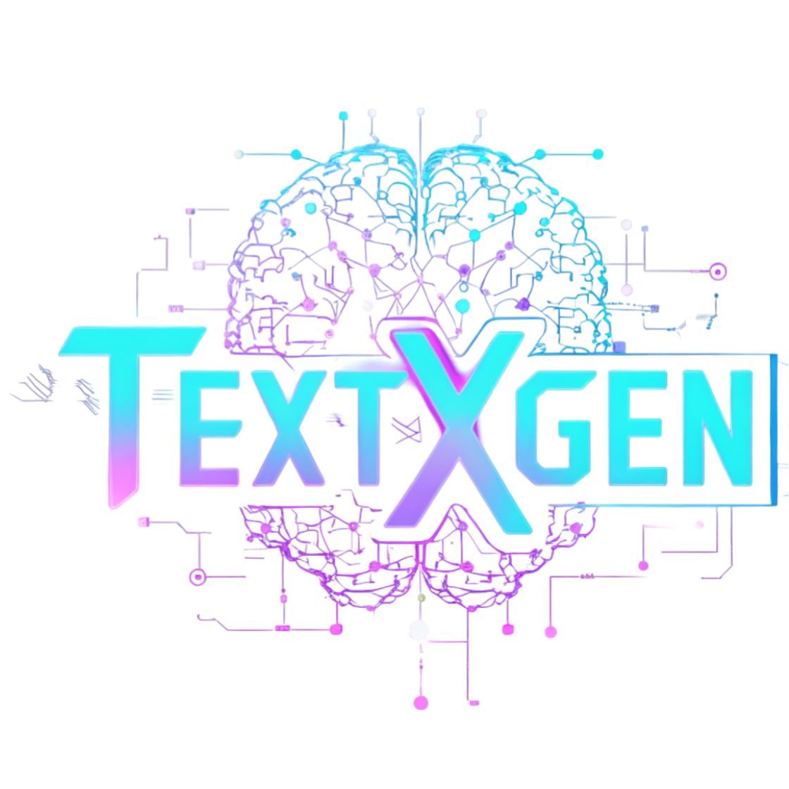

<div align="center">
  

  <h1>TextxGen</h1>
  <p>A powerful Python package for seamless interaction with Large Language Models</p>

  <div align="center" style="margin: 20px 0">
    <a href="https://pystack.site/" target="_blank">
      
    </a>
    &nbsp;
    <a href="https://t.me/sohails_07" target="_blank">
      
    </a>
    &nbsp;
    <a href="https://www.instagram.com/sohails_07" target="_blank">
      
    </a>
    &nbsp;
    <a href="https://pypi.org/project/textxgen/" target="_blank">
      
    </a>
    &nbsp;
    <a href="https://www.python.org" target="_blank">
      
    </a>
  </div>

  <div align="center" style="margin-top: 15px">
    <a href="https://pepy.tech/project/textxgen" target="_blank">
      
    </a>
  </div>
</div>

---

**TextxGen** is a Python package that provides a seamless interface to interact with **Large Language Models**. It supports chat-based conversations and text completions using predefined models. The package is designed to be simple, modular, and easy to use, making it ideal for developers who want to integrate LLM models into their applications.

---

## Features

- **Predefined API Key**: No need to provide your own API key—TextxGen uses a predefined key internally.
- **Chat and Completions**: Supports both chat-based conversations and text completions.
- **System Prompts**: Add system-level prompts to guide model interactions.
- **Error Handling**: Robust exception handling for API failures, invalid inputs, and network issues.
- **Modular Design**: Easily extendable to support additional models in the future.

---

## Installation

You can install TextxGen in one of two ways:

### Option 1: Install via `pip`

```bash
pip install textxgen
```

### Option 2: Clone the Repository

1. Clone the repository from GitHub:
   ```bash
   git clone https://github.com/Sohail-Shaikh-07/textxgen.git
   ```
2. Navigate to the project directory:
   ```bash
   cd textxgen
   ```
3. Install the package locally:
   ```bash
   pip install .
   ```

---

## Key Concepts

Before diving into the API, here's a quick overview of the main components:

- **ChatEndpoint**: Designed for **conversational AI**. It takes a list of messages (user, system, assistant) and maintains the context of a conversation. Use this for chatbots or interactive assistants.
- **CompletionsEndpoint**: Designed for **text generation**. It takes a single text prompt and generates a continuation. Use this for tasks like story writing, code completion, or summarization.
- **Streaming**: Allows you to receive the response **chunk by chunk** in real-time, rather than waiting for the entire response to finish. This creates a more responsive user experience.
- **ModelsEndpoint**: A utility to list all **supported models** and their IDs, helping you choose the right model for your task.
- **System Prompts**: Special instructions given to the model at the start of a chat to define its **behavior, persona, or constraints** (e.g., "You are a helpful coding assistant").
- **Temperature**: A parameter (0.0 to 1.0) that controls the **creativity** of the response. Lower values (e.g., 0.2) make it more focused and deterministic, while higher values (e.g., 0.8) make it more creative and random.
- **Tokens**: The basic units of text used by LLMs (roughly 4 characters or 0.75 words). The `max_tokens` parameter limits the length of the generated response.

---

## API Reference

### Chat Endpoint

The Chat Endpoint provides chat-based interactions with the model.

#### Parameters

| Parameter     | Type  | Default        | Description                                 |
| ------------- | ----- | -------------- | ------------------------------------------- |
| messages      | list  | required       | List of chat messages with role and content |
| model         | str   | "grok4.1_fast" | Model identifier to use                     |
| system_prompt | str   | None           | Optional system prompt to set context       |
| temperature   | float | 0.7            | Sampling temperature (0.0 to 1.0)           |
| max_tokens    | int   | 100            | Maximum tokens to generate                  |
| stream        | bool  | False          | Whether to stream the response              |
| raw_response  | bool  | False          | Whether to return raw JSON response         |

#### Message Format

```python
messages = [
    {"role": "system", "content": "You are a helpful assistant."},  # Optional
    {"role": "user", "content": "Hello, how are you?"},
    {"role": "assistant", "content": "I'm doing well, thank you!"}
]
```

#### Example Usage

```python
from textxgen.endpoints.chat import ChatEndpoint

# Initialize the chat endpoint
chat = ChatEndpoint()

# Simple chat completion
messages = [{"role": "user", "content": "What is artificial intelligence?"}]
response = chat.chat(
    messages=messages,
    model="grok4.1_fast",
    temperature=0.7,
    max_tokens=100,
)
print(f"AI: {response}")

# Chat with system prompt
messages = [
    {"role": "system", "content": "You are a helpful AI assistant."},
    {"role": "user", "content": "Explain quantum computing in simple terms."},
]
response = chat.chat(
    messages=messages,
    model="grok4.1_fast",
    temperature=0.7,
    max_tokens=150,
)
print(f"AI: {response}")

# Streaming chat completion
messages = [{"role": "user", "content": "Write a short story about a robot."}]
for content in chat.chat(
    messages=messages,
    model="grok4.1_fast",
    temperature=0.8,
    max_tokens=100,
    stream=True,
):
    print(content, end="", flush=True)
```

### Completions Endpoint

The Completions Endpoint provides text completion functionality.

#### Parameters

| Parameter    | Type     | Default        | Description                         |
| ------------ | -------- | -------------- | ----------------------------------- |
| prompt       | str      | required       | Input prompt for text completion    |
| model        | str      | "grok4.1_fast" | Model identifier to use             |
| temperature  | float    | 0.7            | Sampling temperature (0.0 to 1.0)   |
| max_tokens   | int      | 100            | Maximum tokens to generate          |
| stream       | bool     | False          | Whether to stream the response      |
| stop         | list/str | None           | Stop sequences to end generation    |
| n            | int      | 1              | Number of completions to generate   |
| top_p        | float    | 1.0            | Nucleus sampling parameter          |
| raw_response | bool     | False          | Whether to return raw JSON response |

#### Example Usage

```python
from textxgen.endpoints.completions import CompletionsEndpoint

# Initialize the completion endpoint
completions = CompletionsEndpoint()

# Simple text completion
response = completions.complete(
    prompt="Write a haiku about nature:",
    model="grok4.1_fast",
    temperature=0.7,
    max_tokens=50,
)
print(f"Completion: {response}")

# Text completion with stop sequences
response = completions.complete(
    prompt="Once upon a time,",
    model="grok4.1_fast",
    temperature=0.8,
    max_tokens=100,
    stop=["The End", "END"],
    top_p=0.9,
)
print(f"Completion: {response}")

# Streaming text completion
for content in completions.complete(
    prompt="Write a short poem about technology",
    model="grok4.1_fast",
    temperature=0.8,
    max_tokens=100,
    stream=True,
):
    print(content, end="", flush=True)

# Multiple completions with raw response
response = completions.complete(
    prompt="Give me three different ways to say 'hello':",
    model="grok4.1_fast",
    temperature=0.9,
    max_tokens=50,
    n=3,
    raw_response=True,
)
print("Raw Response:", response)
```

---

## Usage

### 1. Chat Example

Use the `ChatEndpoint` to interact with chat-based models.

```python
from textxgen.endpoints.chat import ChatEndpoint

def main():
    # Initialize the ChatEndpoint
    chat = ChatEndpoint()

    # Define the conversation messages with system prompt
    messages = [
        {"role": "system", "content": "You are a helpful AI assistant."},
        {"role": "user", "content": "What is the capital of France?"},
    ]

    # Send the chat request
    response = chat.chat(
        messages=messages,
        model="grok4.1_fast",  # Use the Grok 4.1 Fast model
        temperature=0.7,  # Adjust creativity
        max_tokens=100,   # Limit response length
    )

    # Print the response
    print("User: What is the capital of France?")
    print(f"AI: {response}")

if __name__ == "__main__":
    main()
```

**Output:**

```
User: What is the capital of France?
AI: The capital of France is Paris.
```

### 2. Completions Example

Use the `CompletionsEndpoint` to generate text completions.

```python
from textxgen.endpoints.completions import CompletionsEndpoint

def main():
    # Initialize the CompletionsEndpoint
    completions = CompletionsEndpoint()

    # Send the completion request
    response = completions.complete(
        prompt="Write a haiku about nature:",
        model="grok4.1_fast",      # Use the Grok 4.1 Fast model
        temperature=0.7,     # Adjust creativity
        max_tokens=50,       # Limit response length
        top_p=0.9,          # Nucleus sampling
    )

    # Print the response
    print("Prompt: Write a haiku about nature:")
    print(f"Completion: {response}")

if __name__ == "__main__":
    main()
```

**Output:**

```
Prompt: Write a haiku about nature:
Completion: Gentle breeze whispers,
Leaves dance in golden sunlight,
Nature's quiet song.
```

### 3. Streaming Examples

#### Chat Streaming

```python
from textxgen.endpoints.chat import ChatEndpoint

# Initialize the ChatEndpoint
chat = ChatEndpoint()

# Define the conversation messages with system prompt
messages = [
    {"role": "system", "content": "You are a helpful AI assistant."},
    {"role": "user", "content": "Write a short story about a robot."},
]

# Send the chat request with streaming
print("User: Write a short story about a robot.")
print("AI: ", end="", flush=True)
for content in chat.chat(
    messages=messages,
    model="grok4.1_fast",
    temperature=0.8,
    max_tokens=100,
    stream=True,  # Enable streaming
):
    print(content, end="", flush=True)
print("\n")
```

**Output:**

```
User: Write a short story about a robot.
AI: In a bustling city of tomorrow, a small robot named Spark spent its days cleaning the streets. Unlike other robots, Spark had developed a curious habit of collecting lost items and trying to return them to their owners. One day, while cleaning a park bench, it found a small music box. As it played the melody, people gathered around, and for the first time, the city's residents saw robots not just as machines, but as beings capable of bringing joy and wonder to their lives.
```

#### Completion Streaming

```python
from textxgen.endpoints.completions import CompletionsEndpoint

# Initialize the CompletionsEndpoint
completions = CompletionsEndpoint()

# Send the completion request with streaming
print("Prompt: Write a poem about technology")
print("Completion: ", end="", flush=True)
for content in completions.complete(
    prompt="Write a poem about technology",
    model="grok4.1_fast",
    temperature=0.8,
    max_tokens=100,
    stream=True,  # Enable streaming
):
    print(content, end="", flush=True)
print("\n")
```

**Output:**

```
Prompt: Write a poem about technology
Completion: In circuits deep and silicon bright,
Machines dance in digital light.
From simple tools to AI's might,
Human dreams take flight.
Each byte a story, each code a song,
In this world where we belong.
```

### 4. Listing Supported Models

Use the `ModelsEndpoint` to list and retrieve supported models.

```python
from textxgen.endpoints.models import ModelsEndpoint

def main():
    """
    Example usage of the ModelsEndpoint to list and retrieve supported models.
    """
    # Initialize the ModelsEndpoint
    models = ModelsEndpoint()

    # List all supported models
    print("=== Supported Models ===")
    for model_name, display_name in models.list_display_models().items():
        print(f"{model_name}: {display_name}")

if __name__ == "__main__":
    main()
```

---

## Supported Models

TextxGen currently supports 50+ models:

| Model Name                    | Model ID                | Description                                                                              |
| ----------------------------- | ----------------------- | ---------------------------------------------------------------------------------------- |
| AFM 4.5B                      | `afm_4.5b`              | Lightweight 4.5B model for general chat and basic reasoning tasks.                       |
| Command R7B                   | `command_r7b_2024`      | Cohere’s 7B enterprise model optimized for RAG, workflows, and structured responses.     |
| Cydonia 24B V4.1              | `cydonia_24b`           | Creative storytelling and roleplay model with expressive writing capability.             |
| Deepseek Chat v3.1            | `deepseek_chat_v3_1`    | High-performance chat model with strong reasoning and coding support.                    |
| Deepseek R1 Distill Llama 70B | `deepseek_r1_llama_70b` | Large reasoning-focused model distilled from DeepSeek-R1 for complex problem-solving.    |
| Devstral Small 2505           | `devstral_small_2505`   | Mistral-based coding model built for repo understanding and software development agents. |
| Gemini 2.5 Flash Lite         | `gemini_2.5_flash_lite` | Extremely fast, low-cost Gemini variant ideal for scalable assistant workloads.          |
| Gemini 2.0 Flash              | `gemini_2.0_flash`      | Fast Gemini model optimized for general chat and multimodal reasoning efficiency.        |
| Gemma 2 9B IT                 | `gemma_2_9b`            | Google Gemma 9B instruction-tuned model for reasoning and coding tasks.                  |
| Gemma 3N E4B IT               | `gemma_3n_e4b`          | Next-generation Gemma with improved alignment and compact reasoning capabilities.        |
| Granite 4.0 H Micro           | `granite_4_micro`       | IBM Granite micro-model designed for secure, enterprise-focused generation.              |
| GPT-4.1 Nano                  | `gpt_4.1_nano`          | Ultra-compact GPT-4-family model meant for lightweight assistants and utility tasks.     |
| GPT-4o Mini                   | `gpt_4o_mini`           | Cost-efficient GPT-4o variant offering fast, high-quality multimodal responses.          |
| GPT-5 Nano                    | `gpt_5_nano`            | Experimental GPT-5 small model offering improved reasoning density per token.            |
| GPT-OSS 120B                  | `gpt_oss_120b`          | Open-source aligned 120B scale model for high-level reasoning and generation.            |
| Grok 4.1 Fast                 | `grok4.1_fast`          | Real-time reasoning model trained on live web data by xAI; optimized for speed.          |
| Hermes 3 Llama-3.1 70B        | `hermes_l3_70b`         | Advanced Hermes-tuned 70B Llama model for deep reasoning and RP.                         |
| Hermes 2 Pro Llama-3 8B       | `hermes_l3_8b`          | Strong 8B assistant model for reasoning, coding, and character-style dialogue.           |
| InternVL-3 78B                | `internvl3_78b`         | Large multimodal model designed for complex visual reasoning tasks.                      |
| Kat Coder Pro                 | `kat_coder_pro`         | Code-focused model specializing in debugging, refactoring, and repo-level context.       |
| Kimi Linear 48B A3B           | `kimi_48b`              | Long-context bilingual reasoning model optimized for research-style responses.           |
| LFM2 8B A1B                   | `lfm2_8b`               | Updated Liquid model with improved reasoning and software understanding.                 |
| LFM 2.2 6B                    | `lfm_2.2_6b`            | Lightweight 6B model for summaries, structured output, and chat.                         |
| Llama-3.1 8B Instruct         | `llama_3.1_8b`          | Improved Llama-3 instruction model with stronger alignment and reasoning.                |
| Llama-3.2 11B Vision Instruct | `llama_3.2_11b_vision`  | Vision-enabled Llama model capable of interpreting images alongside text.                |
| Llama-3.2 1B Instruct         | `llama_3.2_1b`          | Smallest Llama model suitable for device-level assistants and quick responses.           |
| Llama-3.2 3B Instruct         | `llama_3.2_3b`          | Efficient mid-range assistant model with reasonable reasoning capability.                |
| Llama-3 8B Instruct           | `llama_3_8b`            | Base Llama-3 instruction model for balanced chat, reasoning, and code.                   |
| Llama-4 Maverick              | `llama_4_maverick`      | Next-generation Llama model focused on advanced reasoning and structured responses.      |
| Llama Guard-3 8B              | `llama_guard_3_8b`      | Safety model designed for content moderation and filtering.                              |
| Longcat Flash Chat            | `longcat_flash_chat`    | Long-context chat model built for document-aware multi-turn conversations.               |
| Lunaris 8B                    | `lunaris_8b`            | Emotionally expressive roleplay and writing assistant with natural tone.                 |
| Ministral 3B                  | `ministral_3b`          | Small Mistral family model optimized for speed and lightweight chat.                     |
| Mistral Small 24B             | `mistral_24b_2501`      | Updated Mistral 24B model with improved alignment and performance.                       |
| Mistral 7B Instruct           | `mistral_7b`            | Well-known efficient 7B open-source model for assistants and coding.                     |
| Mistral NEMO                  | `mistral_nemo`          | NVIDIA + Mistral collaboration model optimized for reasoning and tool use.               |
| Mistral Small 3.2 24B         | `mistral_small_24b`     | Advanced 24B assistant model with strong reasoning and API-agent ability.                |
| MythoMax L2 13B               | `mytho_l2_13b`          | Creative RP-focused model specializing in long character conversations.                  |
| Nemotron Nano 12B V2 VL       | `nemotron_12b_v2_vl`    | NVIDIA multimodal model with strong vision reasoning support.                            |
| Nemotron Nano 9B V2           | `nemotron_9b_v2`        | Compact NVIDIA model tuned for dataset generation, reasoning and coding.                 |
| Nova Lite V1                  | `nova_lite`             | Balanced Amazon Nova model for general assistance and reasoning.                         |
| Nova Micro V1                 | `nova_micro`            | Extremely fast Nova model ideal for memory-light or high-volume use cases.               |
| OLMo-3 7B Instruct            | `olmo_3_7b`             | Open research model built for transparency and reproducible output quality.              |
| Phi-4                         | `phi_4`                 | Small Microsoft model with strong reasoning relative to size.                            |
| Phi-4 Reasoning+              | `phi_4_reasoning`       | Enhanced Phi-4 designed specifically for structured step-by-step reasoning.              |
| Qwen-3 14B                    | `qwen3_14b`             | Mid-size Qwen model offering balanced reasoning, coding, and chat.                       |
| Qwen-3 Coder 30B A3B          | `qwen3_30b`             | High-tier coding model capable of repo-level reasoning and generation.                   |
| Qwen-3 32B                    | `qwen3_32b`             | Larger Qwen model with strong reasoning and conversation depth.                          |
| Qwen-3 Coder                  | `qwen3_coder`           | Lightweight coder-assistant model for debugging and code generation.                     |
| Qwen-2.5 VL 72B               | `qwen_2.5_vl_72b`       | State-of-the-art multimodal Qwen with advanced reasoning and vision.                     |
| Qwen-3 VL 8B Instruct         | `qwen_vl_8b`            | Efficient multimodal assistant capable of reading images and documents.                  |
| UnslopNemo-12B                | `unslopnemo_12b`        | Expressive roleplay storytelling model tuned for emotional conversational tone.          |
| Voxtral Small 24B             | `voxtral_24b`           | Mistral-based conversationalist model optimized for natural speechlike responses.        |

---

## Error Handling

TextxGen provides robust error handling for common issues:

- **Invalid Input**: Raised when invalid input is provided (e.g., empty messages or prompts).
- **API Errors**: Raised when the API returns an error (e.g., network issues or invalid requests).
- **Unsupported Models**: Raised when an unsupported model is requested.

**Example:**

```python
from textxgen.exceptions import InvalidInputError

try:
    response = chat.chat(messages=[])
except InvalidInputError as e:
    print("Error:", str(e))
```

---

## Contributing

Contributions are welcome! To contribute to TextxGen:

1. Fork the repository.
2. Create a new branch for your feature or bugfix.
3. Submit a pull request with a detailed description of your changes.

---

## License

TextxGen is licensed under the MIT License. See the [LICENSE](LICENSE) file for details.

---

## Buy Me a Coffee

If you find TextxGen useful and would like to support its development, you can buy me a coffee! Your support helps maintain and improve the project.

[](https://www.buymeacoffee.com/sohails07)

---

## Support

If you encounter any issues or have questions, please open an issue on the [GitHub repository](https://github.com/Sohail-Shaikh-07/textxgen).
